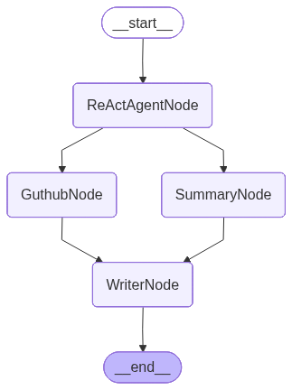
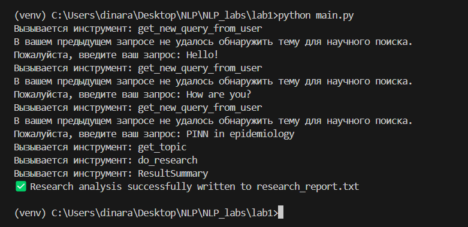
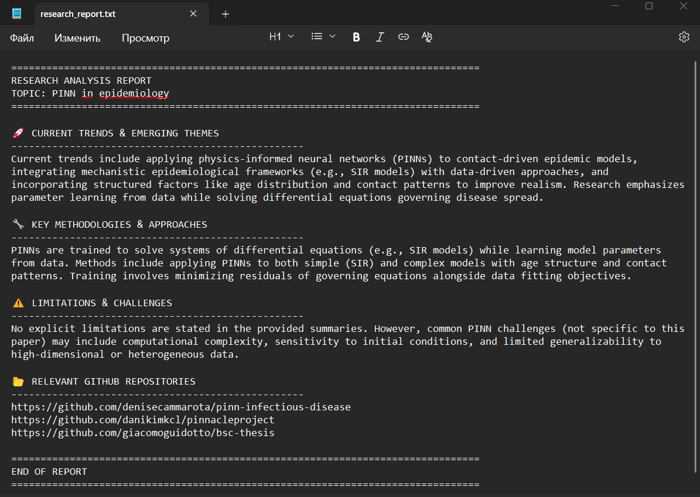

# SciResearch Agent

Агент-исследователь, который помогает находить и анализировать научную информацию из баз данных arXiv и Crossref с дополнительными возможностями поиска репозиториев GitHub.

## Структура проекта

```
lab1/
├── agent_tools/
│   ├── arxiv_search_tool.py     # Поиск в arXiv
│   ├── crossref_api_tool.py     # API Crossref
│   ├── do_research_tool.py      # Основной инструмент исследований
│   ├── new_query_tool.py        # Получение новых запросов
│   └── topic_search_tool.py     # Поиск по темам
├── data_formats/
│   └── input_output_formats.py  # Форматы данных
├── nodes/
│   ├── agent_node.py            # Узел ReAct агента
│   ├── github_node.py           # Поиск в GitHub
│   ├── summary_node.py          # Генератор сводок
│   └── writer_node.py           # Создание отчетов
├── utils/
│   ├── retry_decorator.py       # декоратор для retry API
│   └── retry_parser.py          # retry для ошибок LLM
├── SciResearch_agent.png        # Визуализация pipeline
├── config.py                    # Конфигурация
└── main.py                      # Главный скрипт
```

## Описание

SciResearch Agent построен на основе LangGraph и реализует многокомпонентный pipeline для базового поиска научной информации:

- **ReAct Agent Node**: Выполняет рассуждения и использует инструменты (вызовы функций, API)
- **Summary Node**: Генерирует сводки исследований
- **GitHub Node**: Ищет релевантные репозитории GitHub
- **Writer Node**: Создает финальные исследовательские отчеты

## Возможности

- **Многопоточные исследования**: Поиск в базах данных arXiv и Crossref. Запросы по API в arXix и Crossref идут параллельно.
- **Интеграция с GitHub**: Поиск соответствующих репозиториев с кодом. Поиск репозиториев был вынесен в отдельную ноду, так как нет особой надобности просить LLM суммаризировать полученную по GitHub API информацию (там самое ценное -- url; описания репозиториев мало где есть хорошие). Также для выдачи пользователю гарантированно валентной ссылки не стоит опять же отправлять ее в LLM (SummaryNode), потому что всегда есть риск галлюцинаций LLM. 
Для того чтобы сэкономить время, запуски SummaryNode и GithubNode реализованы параллельно (их работа друг от друга не зависит).
- **Структурированный вывод**: Использование определенных форматов данных для согласованных результатов.
- **Функции Retry**: Для того чтобы сделать систему более надежной, были реализованы функции retry.

    1. декоратор @retry_on_failure для повторной отправки запросов по API c экспоненциальным временем задержки.
    2. класс RetryParser для повторной отправки запросов в LLM, если предыдущий ответ не удалось распарсить.
    *  Для большей наглядности и демострации работы функций retry был добавлен код по рандомному выбрасыванию ошибок (с низкой вероятностью их появления <0.4)

## Архитектура Pipeline



Pipeline работает по следующей схеме:
1. **START** → **ReActAgentNode** (начальное исследование и рассуждения)
2. **ReActAgentNode** → **SummaryNode** (генерация сводки исследования)
3. **ReActAgentNode** → **GuthubNode** (поиск репозиториев GitHub)
4. **SummaryNode** → **WriterNode** (компиляция сводки в отчет)
5. **GuthubNode** → **WriterNode** (включение найденных репозиториев)
6. **WriterNode** → **END** (финальный вывод отчета)


## Инструменты ReAct агента

- **Поиск в arXiv**: Нахождение релевантных научных статей
- **API Crossref**: Доступ к метаданным публикаций
- **Поиск по темам**: Идентификация исследовательских тем
- **Инструмент новых запросов**: Обработка последующих вопросов
- **Поиск в GitHub**: Нахождение реализаций кода

## Форматы данных

Система использует структурированные форматы данных, определенные в `input_output_formats.py`:
- `ResultSummary`: Промежуточные результаты исследований
- `ResearchSummary`: Скомпилированные исследовательские находки
- `GraphState`: Управление состоянием для pipeline
- и прочие служебные форматы.

## Пример работы SciResearch Agent

1. Отправляю нерелеватный для SciResearch Agent запрос "Hello!"
2. ReAct агент анализирует запрос и просит пользователя переформулировать запрос, так как научная тема не была найдена (такое будет происходить пока пользователь не введет корректный запрос).
3. Для того чтобы из запроса пользователя выделить четкую тему, ReAct агент при необходимости может вызвать инструмент get_topic, который отправит запрос LLM для выделения главной темы. Ниже пример вывода в консоль:
    
4. Как только агент получит всю необходимую информацию для поиска он параллельно отправит запросы по API в arXiv и Crossref. 
5. После получения данных из arXiv и Crossref, запускаются GithubNode для получения ссылкок на репозитории и SummaryNode для извлечения и обобщения информации.
6. Как две эти ноды отработают, запускается WriterNode, который красиво запишет полученную информацию в файл 

## Установка

1. Клонируйте репозиторий:
```bash
git clone https://github.com/blabla9111/NLP_labs.git
```

2. Установите зависимости (убедитесь, что установлены LangChain, LangGraph и другие необходимые пакеты):
```bash
pip install -r requirements.txt
cd NLP_labs/lab1
```

3. Настройте API ключи в `config.py`:
```python
BASE_URL = "ваш_deepseek_api_base"
API_KEY = "ваш_deepseek_api_key"
MODEL_NAME = "deepseek-chat"
GITHUB_API_TOKEN = "ваш_github_token"
```
4. Запуск

Запустите главный скрипт:

```bash
python main.py
```
