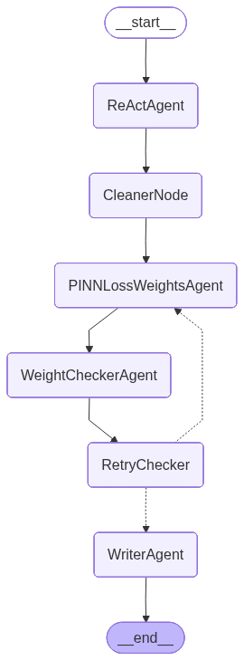

# Мультиагентная система для подбора весов физически информированной нейронной сети (PINN) на основе комментариев эксперта-эпидемиолога

За основу данной лабораторной работы была взята моя НИР, в которой разрабатывается система для адаптации прогноза распространения ОРВИ под комментарий эпидемиолога. Предполагается, что такой программный продукт поможет использовать и данные, и экспертные знания для получения более точного прогноза.

Данная мультиагентная система должна на основании комментария подобрать веса для функции потерь PINN. 
В данной реализации функция потерь состоит из следующих частей:
1. Data Loss -- Минимизирует расхождение между предсказанными и наблюдаемыми значениями SIRD
2. ODE Loss -- Обеспечивает выполнение дифференциальных уравнений SIRD модели
3. Initial/Boundary Conditions Loss -- Граничные и начальные условия
4. Peak Height Loss -- Штрафует отклонение от ожидаемой высоты пика инфекции
5. Slow Growth Penalty -- Наказывает модели с неестественно медленным ростом инфекций
6. Rapid Growth Penalty -- Наказывает модели с нереалистично быстрым распространением

Целью мультиагентной системы является генерация весов для частей функции потерь.

```

input: комментарий эксперта

output: веса для частей функции потерь
```

## Агенты системы
1. **ReActAgent (Валидация и классификация)**

    Проверяет экспертный комментарий и определяет его категорию

    Вход: Текст комментария

    Выход: Структурированные данные с валидацией и классификацией

    Инструменты: 3 инструмента для проверки, запроса исправлений и классификации

2. **PINNLossWeightsAgent (Генерация весов)**

    Преобразует комментарий в числовые веса для PINN-функции потерь

    Вход: Валидированный комментарий с классификацией

    Выход: Веса для разных компонент функции потерь

3. **WeightCheckerAgent (Проверка весов)**

    Проверяет корректность сгенерированных весов

    Вход: Веса от PINNLossWeightsAgent

    Выход: Результат проверки с ошибками/успехом

5. **RetryChecker (Диспетчер)**

    Решает, повторить генерацию или завершить процесс

    Условия: Максимум 5 попыток, анализ ошибок валидации

4. **WriterAgent (Запись результатов)**

    Сохраняет финальные результаты в файл

    Вход: Проверенные веса и все промежуточные данные

    Выход: Физический файл с результатами


## Архитектура Pipeline



## Паттерны МАС
1. Конвейер специализированных агентов (Pipeline)

    Пользователь → ReAct → PINNLossWeights → WeightChecker → WriterNode

    Каждый агент решает одну задачу, передает результат дальше.

2. Супервизор-рабочий (Supervisor-Worker)

    Супервизор: RetryChecker передает управление PINNLossWeightsAgent для генерации (если были ошибки) или WriterNode для записи результатов. RetryChecker не обращается к LLM, но здесь в этом нет необходимости, так как есть строгое определение, что если есть ошибки в генерации, то нужно вызывать PINNLossWeightsAgent.


## Tool Calling
Только ReActAgent использует инструменты:

- check_comment_validity - проверка комментария. Внутри него реализован RetrieverAgent, который отправляет запрос в векторную БД и получает список из комментариев эксперта, которые могут быть похожими на текущий. Затем эти комментарии добавляются в пропмт, чтобы LLM на основе оценила корректность нового комментария, а в случае если он не подходит по критериям корректности, LLM сможет дать рекомендации пользователю по улучшению на базе комментариев из БД. Код с созданием БД представлен в [RAG_example.ipynb](./RAG_example.ipynb)

- get_new_comment_from_expert - запрос исправлений

- get_class_subclass_names - классификация комментария на класс и подкласс (собственная модель на основе BERT)


## Управление памятью
- Хранится: История сообщений, состояние сессии, счетчик кол-ва передач управления между агентами PINNLossWeightsAgent и WeightCheckerAgent

- Очистка: CleanerNode удаляет старые сообщения для экономии контекста

## 🚀 Запуск
```bash
# установка библиотек
pip install -r requirements.txt
cd NLP_labs/lab2

# Настройка
edit config.py  # добавить API-ключ

# Запуск
python main.py